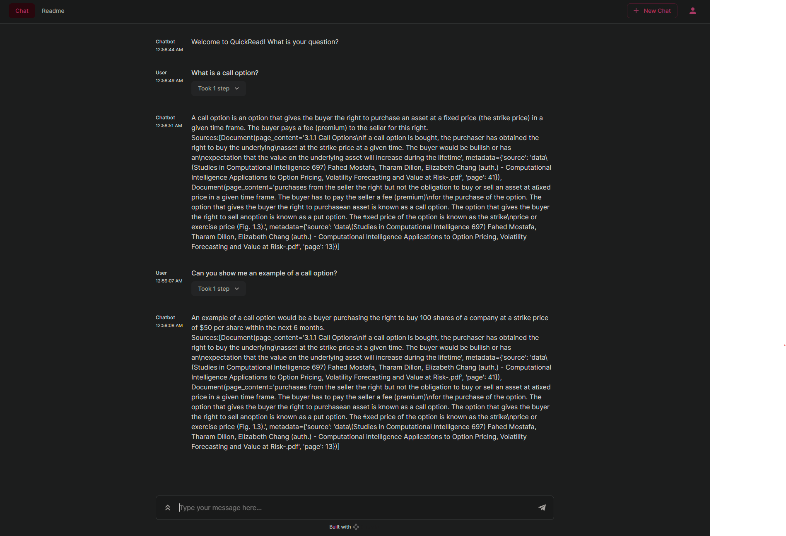

# QuickRead
PDF reader using the llama-2-7b language model or any other chat model you choose to use.

Uses LangChain's RetrievalQA, tracks sources of information and returns best answer.
- Install requirements 'pip install -r requirements.txt'
- Download desired LLM or use OpenAIs LLM. [Llama-2-7b](https://huggingface.co/TheBloke/Llama-2-7B-Chat-GGML/blob/main/llama-2-7b-chat.ggmlv3.q8_0.bin)
- Place PDFs into /data folder (create 'data' folder if necessary).
- Run ingest.py
- Run chainlit 'chainlit run model.py -w'

